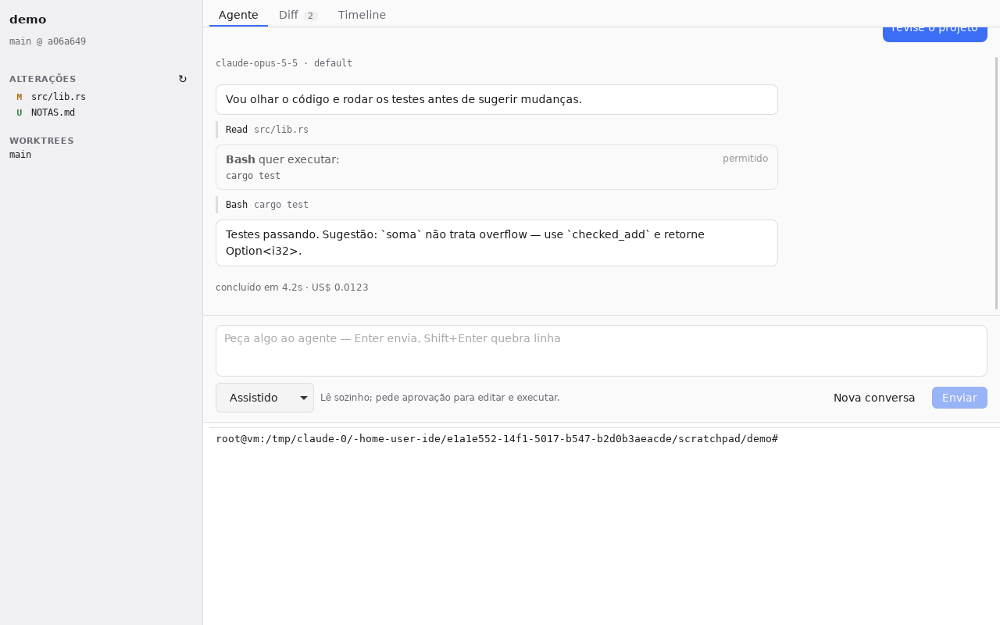
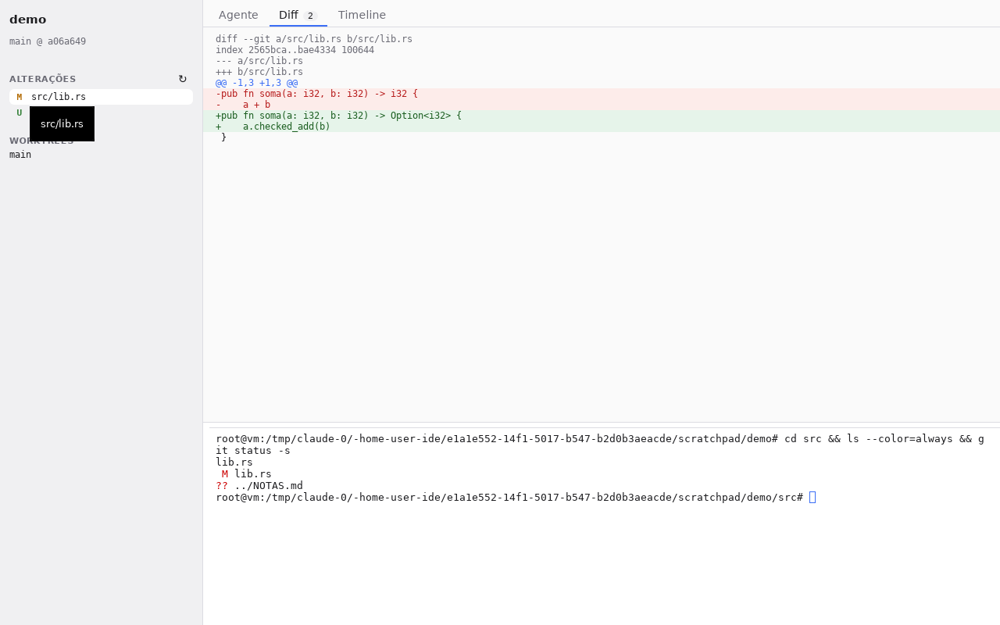
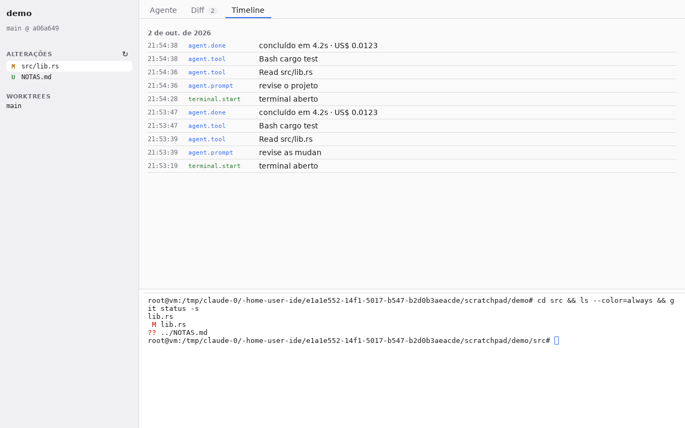

# ide — AI Development OS pessoal

Ambiente de desenvolvimento sob medida, local-first, construído em volta de um agente.
Visão completa e fases em [`docs/ROADMAP.md`](docs/ROADMAP.md).

## App desktop (Tauri 2 + SolidJS)



| | |
|---|---|
|  |  |

O que já funciona (Fase 1):

- **Agente** (Claude Agent SDK num sidecar Node): chat com streaming de texto e
  ferramentas, sessão contínua, "Nova conversa", interromper e três níveis de autonomia:

  | Modo | Leitura | Edição | Comandos |
  |---|---|---|---|
  | Planejar | automática | bloqueada | bloqueados |
  | Assistido | automática | pede aprovação | pede aprovação |
  | Autônomo | automática | automática | pede aprovação |

- **Terminal** real (PTY) com o seu shell, cores e redimensionamento.
- **Diff** do working tree contra o HEAD, inclusive arquivos novos.
- **Timeline** em SQLite: prompts, ferramentas usadas, custo e terminais, por projeto.
- Barra lateral com branch, alterações e worktrees, atualizada ao fim de cada execução.

Monorepo com pnpm workspaces + Cargo workspace. Estrutura e regras em
[`.project/architecture/monorepo.md`](.project/architecture/monorepo.md).

```text
apps/desktop/        @ide/desktop — UI Solid + src-tauri (comandos finos)
crates/core/         ide-core — git: projeto, worktrees, diff
crates/pty/          ide-pty — terminais
crates/timeline/     ide-timeline — eventos em SQLite
crates/agent/        ide-agent — ponte com o sidecar (JSON lines)
packages/agent/      @ide/agent — sidecar Node com o Claude Agent SDK
```

Pré-requisitos: Node ≥ 22, pnpm 10, Rust stable e as
[dependências de sistema do Tauri](https://v2.tauri.app/start/prerequisites/)
(no Linux: `libwebkit2gtk-4.1-dev libayatana-appindicator3-dev librsvg2-dev libxdo-dev`).

O agente usa as credenciais do Claude Code: `ANTHROPIC_API_KEY` no ambiente ou o login
feito com `claude`.

```bash
pnpm install
pnpm dev        # compila o sidecar e abre o app com hot reload, no diretório atual
pnpm check      # typecheck + fmt + clippy + testes (Rust e sidecar)
pnpm build      # instaladores em target/release/bundle
```

O app abre o projeto git do diretório onde foi iniciado.

## Fase 0 — usar hoje com Claude Code

```bash
scripts/install-hooks.sh
```

Copie `CLAUDE.md`, `.project/`, `.claude/`, `.githooks/` e `scripts/` para qualquer
projeto seu para levar o kit junto.

### O que pedir ao agente

| Você diz | O que acontece |
|---|---|
| "analise esse projeto e diga o que melhorar" | skill `analyze-project` → plano priorizado |
| "revise antes de eu commitar" | skill `review-before-commit` → estrutura, revisão, segurança, testes, veredito |
| "organize essas mudanças em commits" | skill `structure-commits` → plano de commits atômicos |
| "explique o último commit" / "o que mudou nesse branch" | skill `explain-commits` |
| "por que essa linha existe?" (arquivo:linha) | `commit-historian` via `git log -L` |
| "como estão meus commits?" | auditoria com nota e exemplos |
| "me dá um tour do projeto" / "trace o fluxo de X" | skill `read-code` → `code-reader` |
| "implemente X sozinho" | skill `autonomous-task` → worktree isolado, testes, revisão, diff |

### Peças

| Caminho | Papel |
|---|---|
| `.project/` | Project Brain: arquitetura, ADRs, convenções, tarefas, memória, glossário |
| `.claude/agents/` | subagentes: `reviewer`, `security-reviewer`, `code-reader`, `commit-historian` |
| `.claude/skills/` | fluxos: análise, revisão, commits, leitura de código, tarefa autônoma |
| `.githooks/commit-msg` | valida Conventional Commits |
| `scripts/worktree.sh` | `new` / `list` / `diff` / `log` / `rm` de worktrees de tarefa |
| `scripts/hotspots.sh` | hotspots (churn × tamanho) e acoplamento temporal |
