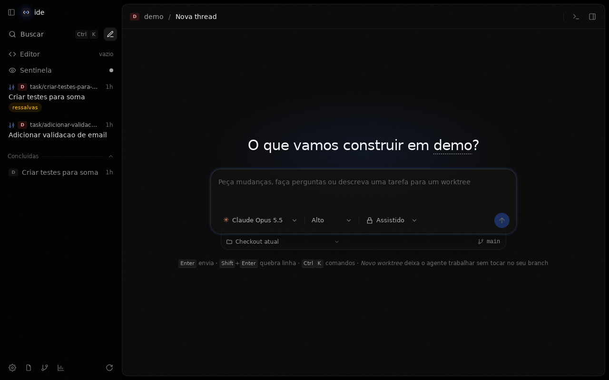
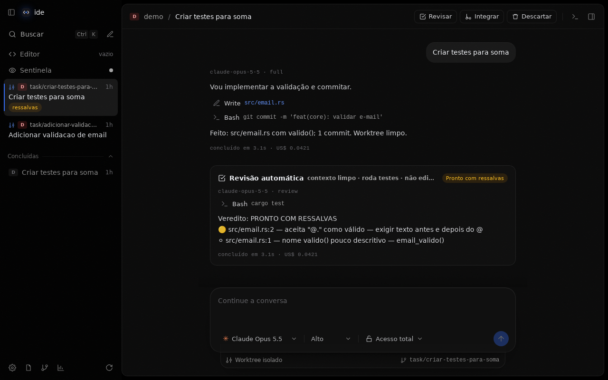
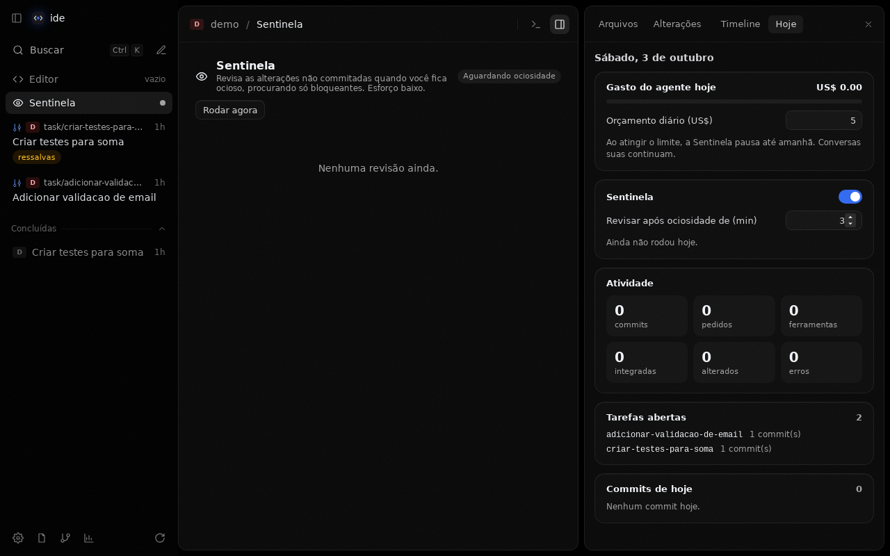
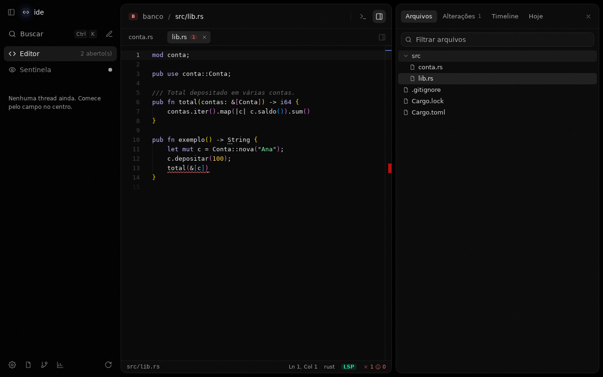
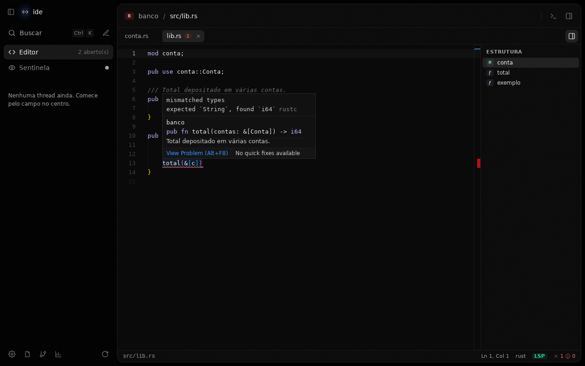
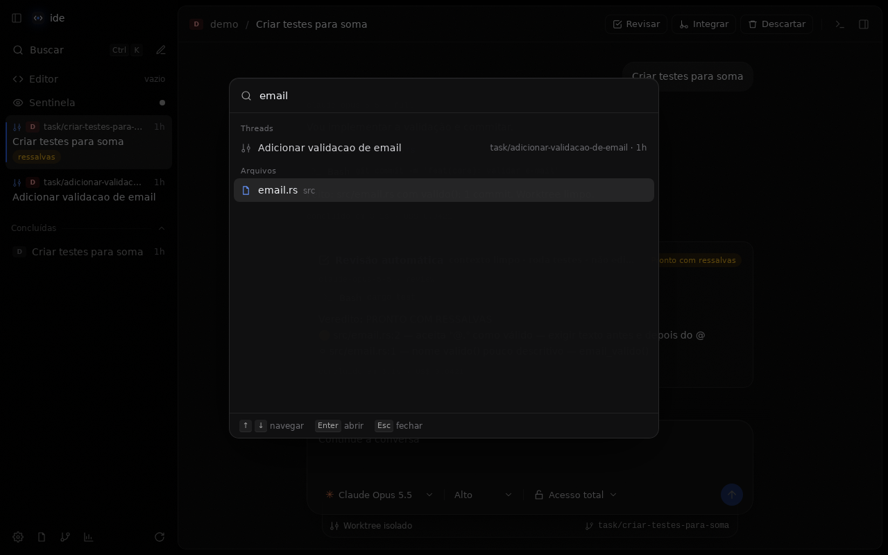

# ide — AI Development OS pessoal

Ambiente de desenvolvimento sob medida, local-first, construído em volta de um agente.
Visão completa e fases em [`docs/ROADMAP.md`](docs/ROADMAP.md).

## App desktop (Tauri 2 + SolidJS)



| | |
|---|---|
|  |  |
|  |  |
|  | |

Interface centrada em **threads**, em **preto moderno** com a linguagem visual do T3 Code
(Fase 5, ADR 0005): corpo e barra lateral em preto puro, a área principal como um card
inset com textura sutil, superfícies flutuantes de vidro e estados por transparência.

- **Paleta de comandos** (`Ctrl+K`): ações, threads e arquivos com busca aproximada;
  `Ctrl+P` abre direto a busca de arquivos. Atalhos: `Ctrl+N` nova thread, `Ctrl+B` barra
  lateral, `Ctrl+J` terminal, `Ctrl+S` salvar no editor.

- **Uma lista de threads** para tudo: conversas no checkout atual e tarefas autônomas em
  worktree, com busca, idade, selos (trabalhando, aguarda você, veredito da revisão) e
  seção de concluídas. Threads ficam salvas e continuam depois de reiniciar o app.
- **Composer** com modelo (Opus 5.5, Sonnet 5.5, Haiku 4.5, Fable 5.1), esforço de
  raciocínio e nível de acesso; embaixo, **Checkout atual** ou **Novo worktree**.
  Escolher worktree cria `task/<slug>`, o agente trabalha sem pedir aprovação e uma
  **revisão automática** (contexto limpo, roda testes, não edita) aparece na thread.
  A barra superior oferece **Revisar · Integrar · Descartar**.
- **Sentinela** (Fase 4): agente em background que, quando você fica ocioso, revisa as
  alterações não commitadas procurando só bloqueantes. Opt-in, esforço baixo, avisa no topo.
- **Hoje** (Fase 4): gasto do dia com **orçamento diário** (corta a Sentinela), atividade,
  tarefas abertas e commits de hoje — calculado localmente, sem chamar o modelo.
- **Editor** (Fase 3): Monaco com abas, árvore de arquivos (respeita `.gitignore`),
  outline (tree-sitter) e **servidor de linguagem** — erros sublinhados, hover, F12 para
  a definição (inclusive em outro arquivo); Ctrl+S salva e o servidor verifica de novo. Usa
  rust-analyzer, typescript-language-server, pyright ou gopls do PATH.
- **Ferramentas para o agente** (Fase 3): o binário `ide-mcp` expõe via MCP
  `outline_file`, `find_symbol`, `project_tree`, `diagnostics` e `definition` — o agente
  vê a estrutura e os erros reais sem ler arquivos inteiros nem rodar o build. As de
  servidor de linguagem pedem aprovação (ele executa código do projeto, ver ADR 0004).
- **Painel lateral** com Alterações (diff), Arquivos, Timeline e Hoje; **terminal** recolhível que
  mantém o shell vivo; avisos no topo para erros, integrações e achados da Sentinela.

  | Acesso | Leitura | Edição | Comandos | Onde |
  |---|---|---|---|---|
  | Planejar | automática | bloqueada | bloqueados | qualquer lugar |
  | Assistido | automática | pede aprovação | pede aprovação | qualquer lugar |
  | Autônomo | automática | automática | pede aprovação | qualquer lugar |
  | Acesso total | automática | automática | automáticos | só worktree de tarefa |
  | Revisão | automática | bloqueada | automáticos | só worktree de tarefa |

Monorepo com pnpm workspaces + Cargo workspace. Estrutura e regras em
[`.project/architecture/monorepo.md`](.project/architecture/monorepo.md).

```text
apps/desktop/        @ide/desktop — UI Solid + src-tauri (comandos finos)
crates/core/         ide-core — git: projeto, worktrees, diff, arquivos
crates/syntax/       ide-syntax — tree-sitter: outline e símbolos
crates/lsp/          ide-lsp — cliente LSP e servidores por linguagem
crates/mcp/          ide-mcp — servidor MCP com as ferramentas do agente
crates/pty/          ide-pty — terminais
crates/timeline/     ide-timeline — eventos em SQLite
crates/agent/        ide-agent — ponte com o sidecar (JSON lines)
packages/agent/      @ide/agent — sidecar Node com o Claude Agent SDK
```

Pré-requisitos: Node ≥ 22, pnpm 10, Rust stable e as
[dependências de sistema do Tauri](https://v2.tauri.app/start/prerequisites/)
(no Linux: `libwebkit2gtk-4.1-dev libayatana-appindicator3-dev librsvg2-dev libxdo-dev`).

O agente usa as credenciais do Claude Code: `ANTHROPIC_API_KEY` no ambiente ou o login
feito com `claude`.

```bash
pnpm install
pnpm dev        # compila o sidecar e abre o app com hot reload, no diretório atual
pnpm check      # typecheck + fmt + clippy + testes (Rust e sidecar)
pnpm build      # instaladores em target/release/bundle, com o sidecar embutido
```

O instalador leva o sidecar, o `ide-mcp` e o CLI nativo do Claude Code (~280 MB no Linux); o Node
ainda precisa estar instalado na máquina.

O app abre o projeto git do diretório onde foi iniciado.

## Fase 0 — usar hoje com Claude Code

```bash
scripts/install-hooks.sh
```

Copie `CLAUDE.md`, `.project/`, `.claude/`, `.githooks/` e `scripts/` para qualquer
projeto seu para levar o kit junto.

### O que pedir ao agente

| Você diz | O que acontece |
|---|---|
| "analise esse projeto e diga o que melhorar" | skill `analyze-project` → plano priorizado |
| "revise antes de eu commitar" | skill `review-before-commit` → estrutura, revisão, segurança, testes, veredito |
| "organize essas mudanças em commits" | skill `structure-commits` → plano de commits atômicos |
| "explique o último commit" / "o que mudou nesse branch" | skill `explain-commits` |
| "por que essa linha existe?" (arquivo:linha) | `commit-historian` via `git log -L` |
| "como estão meus commits?" | auditoria com nota e exemplos |
| "me dá um tour do projeto" / "trace o fluxo de X" | skill `read-code` → `code-reader` |
| "implemente X sozinho" | skill `autonomous-task` → worktree isolado, testes, revisão, diff |

### Peças

| Caminho | Papel |
|---|---|
| `.project/` | Project Brain: arquitetura, ADRs, convenções, tarefas, memória, glossário |
| `.claude/agents/` | subagentes: `reviewer`, `security-reviewer`, `code-reader`, `commit-historian` |
| `.claude/skills/` | fluxos: análise, revisão, commits, leitura de código, tarefa autônoma |
| `.githooks/commit-msg` | valida Conventional Commits |
| `scripts/worktree.sh` | `new` / `list` / `diff` / `log` / `rm` de worktrees de tarefa |
| `scripts/hotspots.sh` | hotspots (churn × tamanho) e acoplamento temporal |
